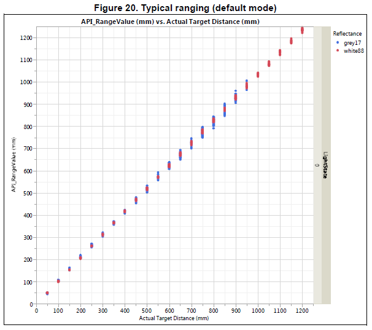
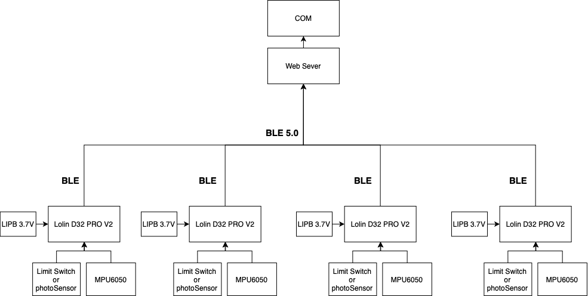

# # Tech_HardWare

- 해먹 감지 - Boolean Type
    - 레이저 수치 값 → 안정화 → true / false 값으로 변환

## ## Arduino

- 엑추에이터
- 센서
    - TOF (Time of Flight)
        
        **1. TOF의 개념**
        
        TOF(Time of Flight)는 신호(근적외선, 초음파, 레이저 등)를 방출하고 수신하여 돌아오는 시간을 계산 하여  거리를 측정하는 기술이다. 
        
        [https://www.epnc.co.kr/news/articleView.html?idxno=82099](https://www.epnc.co.kr/news/articleView.html?idxno=82099)
        
        제품군 
        
        사용 예정 : STm****icroelectronics VL53L0X Time-of-Flight Ranging 센서****
        
        
        
        - Fully integrated miniature module
            - 940nm laser VCSEL ( Vertical Cavity Surface Emitting Laser )
            - VCSEL driver
            - Ranging sensor with advanced embedded microcontroller
            - 4.4x2.4x1.0mm
        
        사이즈 : 4.4 x 2.4 x 1.0mm
        
        무게 : 0.5g
        
        거리 측정 : 최대 2m (모드 및 환경에 따라 달라짐)
        
        인터페이스 : I2C
        
        FOV : 25˚
        
        측정 모드 : 총 4가지가 존재하고, Long Range일때만 2m까지이고 그외에는 1.2m까지..
        
        
        
        
        
        
        
        **[VL53L0X : 고정밀 레이저 거리 센서](https://www.hwlibre.com/ko/vl53l0x/)**
        
        **[ST의 레이져 센서 VL53L0X 테스트](https://blog.naver.com/just4u78/220838152385)**
        
        ****[VL53L0X Distance Sensor](https://eleparts.co.kr/goods/view?no=6469375) / 정밀도 테스트 영상**
        
        ### 초음파 센서, 적외선 센서가 아닌 레이저 센서를 사용하는 이유
        
        - 초음파 또는 적외선 (IR) 기반 센서보다 훨씬 높은 정밀도를 제공
        
    - 자이로 / 가속도 센서
        
        자이로, 가속도 차이 : 측정 단위가 다름. 자이로는 퍼, 가속도 그램.
        
        ### 자이로 센서
        
        자이로(gyro)는 라틴어로 ‘회전하는 것' 이라는 뜻.
        
        자이로 센서는 회전하는 물체의 회전 각을 센서를 통해 감지한다. 물체의 회전 속도인 각속도의 값을 이용하는 센서이기 때문에, ‘각속도 센서' 라고도 한다.
        
        어떤 물체가 회전 운동할 때 생기는 ‘코리올리 힘' 을 전기적 신호로 변환하여 계산한다.
        
        단점 : 측정되는 각속도를 이용하면 시간이 지날 수 록 각도는 오차가 생겨 기울기 값이 변함. 온도에 약함.
        
        ### 가속도 센서
        
        가속도를 측정하는 센서.
        
        x, y, z축 방향의 가속도를 측정 할 수 있다.
        
        단점 : 정지하지 않은 움직임 상태에서는 기울기 값을 측정 할 수 없다.
        
        이 두 센서를 사용 시 각각의 단점을 보상할 수 있는 알고리즘을 적용하면 정확한 입력 값을 얻을 수 있다.
        

## ## 주요 인터렉션

### ### 해먹

2 가지 방식 비교 테스트 필요

1. 단일 센서를 사용하였을 때 안정성
- Tof 센서

1. 센서 퓨전을 사용하였을 때 안정성
- TOF, 가속도/자이로 센서 융합으로 안정성 올리기
    - 다양한 유형의 센서로 데이터의 입력을 받고, 데이터 스트림으로 취합해서 전체적인 환경 요소를 인식 할 수 있게 하여 정밀도, 안정성을 높인다.
    - [다수의 데이터의 평균 값 구할 시 잡음 현상](https://sharehobby.tistory.com/entry/칼만-필터Kalman-filter1) - 칼만 필터 알고리즘
    - [가속도/자이로 센서 퓨전해야하는 이유](https://hs36.tistory.com/entry/mpu6050-가속도-자이로-센서를-융합하기상보필터-1)
    - [가속도/자이로 센서 퓨전해야하는 이유](https://wadadada.tistory.com/15)
    - [https://mechaworld.tistory.com/11](https://mechaworld.tistory.com/11)

### ### 자이로 센서를 연동한 헤드폰

[OSC Protocol](https://www.notion.so/OSC-Protocol-3ee23c90caa7472aba87bbf00839b6f2)

[자이로센서 연동한 헤드폰](https://www.notion.so/3190dcd72d044ec08c7922d63ee92830)

# **하드웨어**

## 전체 시스템 구조

## 아두이노 통신 방법

[https://hjeon.tistory.com/12](https://hjeon.tistory.com/12)

1. **Serial(UART, Universal Asyncronous Receiver/Transmitter) 통신 / 비동기식 통신 방법.**

시리얼 통신은 1:1 통신만 지원 ( 단방향 통신일 때만 1:N 가능 )

아두이노와 아두이노, 아두이노와 PC 간의 연결에 가장 기본이 되는 통신으로, 한번에 한 비트씩 데이터를 지속적으로 주고 받는 직렬 통신을 의미한다.

프로세서에서 병렬로 한번에 처리되는 데이터를 외부 전송을 위해 직렬 데이터 스트림으로 바꿔서 통신

1. I**2C (Inter-Integrated Circuit) / 동기식 통신 방법.**

시그널 핀 2개를 사용해서 여러 장치들과 통신하게 해주는 1:N 통신 프로토콜.

연결이 간단한데 비해 데이터 전송을 위해 하나의 커넥션만 사용하므로 데이터는 한번에 한 방향으로만 전송됩니다. 양방향 전송을 할 경우 속도가 느려지는 단점이 있습니다. 고속의 데이터가 필요치 않은 센서 모듈들을 연결할 때 자주 사용

1:N 통신을 지원하고, 연결 및 코딩이 쉬운 I2C를 이용하여 1:N 제어

1. S**PI (Serial Peripheral Interface) / 동기식 통신 방법.**

SPI는 고속으로 1:N 통신을 위한 프로토콜.

I2C와는 달리 INPUT, OUTPUT 커넥션이 분리되어 있어서 동시에 읽기, 쓰기를 할 수 있으므로 빠른것이 장점입니다. Micro-controller 들 간의 통신에도 사용이 가능합니다

SPI 통신으로는 필요한 핀의 갯수도 많을 뿐 아니라 아두이노 SPI라이브러리에서 슬레이브 모드를 지원하지 않아서 직접 레지스터를 통해 제어를 해야하므로 복잡

[https://blog.daum.net/e-joung/226](https://blog.daum.net/e-joung/226)

- 아두이노와 컴퓨터 간의 데이터 전송은 UART 방식의 시리얼 통신을 사용하게 되는데 비동기식 통신 방식을 사용합니다. 동기식 시리얼 통신 방식인 I2C나 SPI 통신의 경우에는 데이터 수신 타이밍을 위해 Clock 라인을 사용하는 반면 비동기식인 UART 통신은 미리 약속된 통신 속도로 데이터를 전송해야 합니다.
- SPI와 I2C 통신 모두 가능한 센서 모듈들이 존재 합니다. 이때 나의 아두이노와 어떤 통신으로 연결할 것인가의 기준은, 바로 전송할 데이터의 양입니다. 고속으로 많은 양의 데이터를 전송해야 된다면, SPI통신으로 연결되어야 하며, 반대로 저속으로 적은양의 데이터를 전송할 경우에는 I2C 통신을 사용합니다.

[https://increase-life.tistory.com/41](https://increase-life.tistory.com/41)

[https://kocoafab.cc/tutorial/view/451](https://kocoafab.cc/tutorial/view/451)

## 아두이노 다중통신

**마스터/슬레이브**(Master/slave)는 장치나 프로세스(마스터)가 하나 이상의 다른 장치나 프로세스(슬레이브)를 통제하고 통신 허브 역할을 하는 비대칭 통신 및 제어 모델을 의미

[블루투스_마스터, 슬레이브 기술 사용](https://m.blog.naver.com/PostView.naver?isHttpsRedirect=true&blogId=darknisia&logNo=220834623210)

[https://bota.tistory.com/1542](https://bota.tistory.com/1542)

---

## Update/2022_03_31

## # ~~TOF 라이다 센서~~

• 제품군 

사용 예정 : ****[Benewake] TFmini Plus LiDAR 거리 측정 센서 IP65 (10cm-12M)****

[https://github.com/TFmini/TFmini-Plus](https://github.com/TFmini/TFmini-Plus)

1. **Serial(UART, Universal Asyncronous Receiver/Transmitter) 통신 / 비동기식 통신 방법.**

시리얼 통신은 1:1 통신만 지원 ( 단방향 통신일 때만 1:N 가능 )

아두이노와 PC 간의 연결에 가장 기본이 되는 통신으로, 한번에 한 비트씩 데이터를 지속적으로 주고 받는 직렬 통신을 의미한다.

프로세서에서 병렬로 한번에 처리되는 데이터를 외부 전송을 위해 직렬 데이터 스트림으로 바꿔서 통신

## # Problem → Solution

- STm****icroelectronics VL53L0X 센서를 사용하여 블루투스 모듈로 컴퓨터와 통신을 하려했지만, 블루투스통신의 경우 거리가 5~10m 내외로 짧고 기술 자문을 받은 뒤 전시에서 블루투스 모듈은 혼선을 불러 일으킬 수 있다는 문제를 발견했다.****
    
    ### 첫번째 대안 ( 유선 )
    
    
    
    - 블루투스 모듈 대신 USB 리피터를 사용하여 유선으로 PC와 연결하여 데이터 송수신.
    - Tfmini 센서 - UART to USB - USB리피터 - PC
    
    ### 두번째 대안 ( 무선 )
    
    
    
    - 블루투스 통신 대신 RF통신을 통해 PC와 연결하여 데이터를 송수신.
    

## # 센싱 시스템 구조

---

## Update/2022_04_15

## # ~~FSR ( Force Sensitive Sensor ) 압력센서~~

< FSR 압력센서 구조 >

- FSR ( Force Sensitive Sensor ) 압력센서 제품군

• ****[[Interlink ] 압력센서 FSR 408 (609.6mm) Solder Tabs [30-61710]](https://www.devicemart.co.kr/goods/view?no=14404688)****

• [****[Interlink] 압력센서 FSR 402 Solder Tabs [30-81794]****](https://www.devicemart.co.kr/goods/view?no=33870)

## # ~~헤드폰 스탠드_FSR 압력센서~~

- 헤드폰 스탠드 제품군

](#%20Tech_HardWare%20166bf35693644005aaa84d88326efe54/Sabd7d71395f54946b550f3b7ae0ca7aaZ.jpg)

[헤드폰 스탠드 1](https://ko.aliexpress.com/item/1005004060760159.html?spm=a2g0o.productlist.0.0.7c1849b0WDuFB6&algo_pvid=790567da-935f-4a8b-9e7b-7288a59c733f&algo_exp_id=790567da-935f-4a8b-9e7b-7288a59c733f-4&pdp_ext_f=%7B%22sku_id%22%3A%2212000027900904104%22%7D&pdp_pi=-1%3B2494.0%3B-1%3B-1%40salePrice%3BKRW%3Bsearch-mainSearch)

](#%20Tech_HardWare%20166bf35693644005aaa84d88326efe54/H9e3fb6549c34446b9adcea81514ea0f2S.jpg)

[헤드폰 스탠드 2](https://ko.aliexpress.com/item/1005001908836677.html?spm=a2g0o.productlist.0.0.7ed0c7225duqLD&algo_pvid=fddd6318-9931-4eed-bf4a-2f19f58b533b&algo_exp_id=fddd6318-9931-4eed-bf4a-2f19f58b533b-7&pdp_ext_f=%7B%22sku_id%22%3A%2212000018086008740%22%7D&pdp_pi=9839.0%3B1260.0%3B-1%3B-1%40salePrice%3BKRW%3Bsearch-mainSearch)

](#%20Tech_HardWare%20166bf35693644005aaa84d88326efe54/Hf543a426a8974510a504d90de06e4cb8o.jpg)

[헤드폰 스탠드 3](https://ko.aliexpress.com/item/1005003221051610.html?spm=a2g0o.productlist.0.0.7ed0c7225duqLD&algo_pvid=fddd6318-9931-4eed-bf4a-2f19f58b533b&algo_exp_id=fddd6318-9931-4eed-bf4a-2f19f58b533b-26&pdp_ext_f=%7B%22sku_id%22%3A%2212000024723110524%22%7D&pdp_pi=23835.0%3B7936.0%3B-1%3B-1%40salePrice%3BKRW%3Bsearch-mainSearch)

](#%20Tech_HardWare%20166bf35693644005aaa84d88326efe54/H2daa85ff77e842f4927f74e16e46941b6.jpg)

[헤드폰 스탠드 4](https://ko.aliexpress.com/item/1005002482995213.html?spm=a2g0o.productlist.0.0.7ed0c7225duqLD&algo_pvid=a10371dd-b99f-4aed-8702-831540546b2c&algo_exp_id=a10371dd-b99f-4aed-8702-831540546b2c-0&pdp_ext_f=%7B%22sku_id%22%3A%2212000020814520701%22%7D&pdp_pi=25913.0%3B5391.0%3B-1%3B-1%40salePrice%3BKRW%3Bsearch-mainSearch)

|  | Headphone Stand | Size | Strengths / Weaknesses | Price ( 1원 ) |
| --- | --- | --- | --- | --- |
| 1 | 헤드폰 스탠드 1 | 23 x 10.5 x 10.5cm |  | ₩ 3,263 |
| 2 | 헤드폰 스탠드 2 | 20 x 9 x 9cm | FSR센서 부착표면 평탄해서 정확한 센싱 가능성 미지수 | ₩ 1,260 |
| 3 | 헤드폰 스탠드 3 | 28.5 x 12cm |  | ₩ 7,936 |
| 4 | 헤드폰 스탠드 4'’’ | 27 x 10 x 0.5cm |  | ₩ 5,392 |

## # ~~RF통신 - ESP32 Module~~

[https://youtu.be/d7ih7FypnmY](https://youtu.be/d7ih7FypnmY)

[https://www.devicemart.co.kr/goods/view?no=1381615#goods_qna](https://www.devicemart.co.kr/goods/view?no=1381615#goods_qna)

[https://rasino.tistory.com/255](https://rasino.tistory.com/255)

### 1. RF 통신이란

**RF 통신은 이름 그대로 Radio Frequency에서 작동하는 통신이다.** 

통신 주파수 대역은 일반적으로 30kHz에서 300GHz이다. RF 통신에선 digital 신호를 전파에 실어서 송신하는데, 전파에 전달하는 다양한 기법이 있다. Amplitude Shift Keying (ASK)와 Pulse Width Modulation (PWM) 등과 같은 다양한 기법을 사용하여 digital신호를 송신한다. 

RF 통신, IR 통신 비교

1. RF통신은 IR통신에 비교해 더 멀리까지 신호를 전달할 수 있다. 
2. RF통신은 송신기와 수신기 사이에 장애물이 있어도 통신이 가능하다. 
3. IR통신은 다른 IR 신호들에 의해 간섭을 받을 가능성이 높은데 RF 통신은 특정 주파수 대역을 사용하므로 간섭의 영향이 낮다.

### ## ESP32

[https://makernambo.com/54](https://makernambo.com/54)

제품군

1. • ****[[Ai-Thinker] [정품] ESP-32S NodeMCU Lua WiFi 시리얼 와이파이 모듈](https://www.devicemart.co.kr/goods/view?no=1381615)****
2. • ****[[WeMos] [정품] LOLIN D32 V1.0.0 ESP-32 WiFi-Bluetooth Combo 개발보드](https://www.devicemart.co.kr/goods/view?no=1361841#goods_review)****
3. • [****[Espressif Systems] ESP32-DEVKITC-32D****](https://www.devicemart.co.kr/goods/view?no=12507198#goods_description)

**[아두이노 WiFi 통신 (서버와 데이터 주고받기)](https://m.blog.naver.com/microfun/221844914516)**

[아두이노 - 와이파이, ESP01 wifi 모듈 무선 원격제어 그리고 시리얼 통신](https://postpop.tistory.com/23)

## 전원 공급

모터 제어, led 제어와 같이 많은 양의 전력을 필요로 하지 않기 때문에, 일반전지 또는 충전전지로 전원 인가 예정.

1. 9v를 통한 배터리 연결
2. 1.5v AA 6개를 연결해 9v로 구성
3. 외장형배터리 

외장형 배터리는 저전류를 사용할 경우 누설전류를 막기위해 자동전원차단 기능이 있을 수 있다. 이 경우에는 외장형 배터리의 최소 전류 기준보다 많이 사용해야 하기 때문에, 추가 모듈 ( 승압 회로 ) 을 사용할 방법을 고안 중.

## # 센싱 시스템 구조

---

## Update/2022_04_19

## # Technical Research

- ~~헤드폰 스탠드_FSR 센서~~
    - Why?
        - 사용되는 데이터는 착용을 감지하는 boolean type 값만 필요한데, FSR 센서는 analog 값을 받기 때문에 FSR 센서는 비쌈. 효율성 떨어짐.
        - Spatial sound ( 공간음향 )을 구현하기 위해 헤드폰에도 가속도/자이로 센서 부착이 필요하기 때문에 센서들 통합 필요.
    - Solution
        - 헤드폰에 직접 센서와 MCU 부착
    
- ~~RF 통신~~
    - Why?
        - 전력 소비 문제
            - RF 통신은 장거리 송수신에 강점을 지니지만, 사용되는 전시 공간에서는 대략 10M 내외로 장거리 송수신이 필요하지 않기 때문에 고전력의 통신을 사용할만한 효율이 떨어짐.
            - [https://www.digikey.kr/ko/articles/comparison-of-rf-and-bluetooth](https://www.digikey.kr/ko/articles/comparison-of-rf-and-bluetooth)
    - Solution
        - BLE ( bluetooth Low Energy ) 5.0

## # 헤드폰_센서

- 헤드폰 착용감지 센싱
    - 접촉식 센서
        - Limit Switch (500원)
    - 비접촉식 센서
        - 광센서
- Spatial sound를 위한 헤드폰의 roll pitch yaw 값 센싱
    - 가속도 센서 / 자이로 센서
        - 3 axis or 6 axis
            - MPU6050 (3,500원)

## # 개발보드 선정

- Lolin D32 PRO V2 (19,000원)
    - esp32-wrover-e 칩 사용.
    - 업로드 오류
        - ESP32보드내에 CP2102라는 시리얼 칩이 있는데 해당 칩의 드라이버가 설치되지 않아서 발생되는 오류 발생. CP2102칩은 ESP32보드에 프로그램을 업로드할 수 있도록 하는 시리얼통신 칩.
            - ****CH340 Driver 설치로 해결.****
    - 내장된 LED Pin 번호는 5번임.
- Arduino nano 33 iot (28,000원)
    
    
    | 보드 이름  | MCU | 스펙 (최대클럭/플래시 메모리/램) | 특징 |
    | --- | --- | --- | --- |
    | 아두이노 나노 33 IoT | SAMD21G18A | 48MHz/ 256KB/ 32KB, 32Bit | Arm Coretex M0 아키텍처, NINA W102 (ESP32 기반 WIFI, BLE), 6축 IMU, 3.3V I/O 사용 |
    - 내장 된 'LED_BUILTIN' 핀은 D13번.
    
- [G511-02] TTGO T-Display (29,500원)
- Adafruit Feather nRF52840 Express

보드를 헤드폰에 부착 시 경량화, 전력 소비, 상호 운용성, 성능 측면에서 설계 최적화 위해 네 가지 보드 검토 및 테스트 중.

- Lolin D32 PRO V2 | 리튬폴리머 배터리 연결 단자가 내장. 그래서 전원 교체할 떄 용이함.
- Arduino nano 33 iot | 매우 작음, 6축 IMU 센서 내장되어 있어서 효율적임. 그치만 전원 공급을 어떻게 효율적으로 할 수 있을지 생각해보는 중.
- [G511-02] TTGO T-Display |
- Adafruit Feather nRF52840 Express | 작음, 배터리 충전 회로 내장.

## # 통신

- ~~bluetooth 통신 사용~~
    - bluetooth LE 프로토콜
    - [https://velog.io/@zhemdrawer/BLE-이해하기](https://velog.io/@zhemdrawer/BLE-%EC%9D%B4%ED%95%B4%ED%95%98%EA%B8%B0)
    - [https://www.hardcopyworld.com/?p=1132](https://www.hardcopyworld.com/?p=1132)
    - [https://enidanny.github.io/ble/ble5-intro/](https://enidanny.github.io/ble/ble5-intro/)
- RF 통신 433Mhz 대역 사용 (HC-12 Module)
    - [https://diyver.tistory.com/145](https://diyver.tistory.com/145)
    - [https://innoaus.com/posts/20190412/](https://innoaus.com/posts/20190412/)
    - [https://rasino.tistory.com/255](https://rasino.tistory.com/255)

## # 전력 공급

엑추에이터를 사용하지 않아 많은 양의 전력을 필요로 하지 않기 때문에, 3.7V 리튬 폴리머 배터리 연결 ( LIPB ) 로 전력 인가 예정.

- ~~1.5v AA 6개를 연결해 9v로 구성~~
- ~~외장형배터리~~
    - 중량 초과 문제
    - ~~외장형 배터리는 저전류를 사용할 경우 누설전류를 막기위해 자동전원차단 기능이 있을 수 있다. 이 경우에는 외장형 배터리의 최소 전류 기준보다 많이 사용해야 하기 때문에, 추가 모듈 ( 승압 회로 ) 을 사용할 방법을 고안 중.~~
- ~~리튬 이온 배터리 연결~~
    - 중량 초과 문제
- 3.7V 리튬 폴리머 배터리 연결 ( LIPB )
    - [https://blog.naver.com/behappydw/114551121](https://blog.naver.com/behappydw/114551121)

## # 전력량 계산

전력 (P) = 전압 (V)*전류 (I) `// 단위 시간 (1초) 당 전기가 하는 일의 양 = 전력`

전력량 (W) = 전력 (P)*시간 (T) `// 일정 시간 (40초) 동안 전기가 하는 일의 양 = 전력량`

[소비전력과 사용가능시간](http://shga.kr/archives/165)

## # 부품비

| 보드 | 6축 IMU 센서 | 리밋 스위치 | 합계 |
| --- | --- | --- | --- |
| Lolin D32 PRO V2 (19,000원)*5 | MPU6050 (3,500원)*4 | 500*4 | 110,000원 |
| Arduino nano 33 iot (28,000원)*5 | 없음 | 500*4 | 142,000원 |

---

## Update/2022_04_30

## # week8_Tech_Feedback

- 컷팅회로 없어서 충돌 가능성
- Lolin D32 보드 대체 TTGO T4 모듈이 더 간편할 것.
- 블루투스 권장 안함.
    - RF 433대역이나, 915대역으로 넘어갈 것 추천.

## # 센싱 테스트

- 헤드폰 착용감지 센싱
    - 접촉식 센서
        - Limit Switch
            - 테스트 결과 인식 잘함.
            - 마감을 어떻게 할 건지 고민 중 (헤드폰에 어떻게 불일지).
    - 비접촉식 센서
        - 광센서
- Spatial sound를 위한 헤드폰의 roll pitch yaw 값 센싱
    - 가속도 센서 / 자이로 센서
        - MPU6050 - 6axis
        - i2c 통신을 사용함.
        [https://m.blog.naver.com/yuyyulee/220325361752](https://m.blog.naver.com/yuyyulee/220325361752)
        - [https://www.tutorialspoint.com/esp32_for_iot/interfacing_esp32_with_mpu6050.htm](https://www.tutorialspoint.com/esp32_for_iot/interfacing_esp32_with_mpu6050.htm)
            
            Register-Map 파일
            
            - 1차_센서 값 확인하기 ( UNO Board )
            - [https://chigun.tistory.com/20](https://chigun.tistory.com/20)
                
                [MPU6050_test1.mov](#%20Tech_HardWare%20166bf35693644005aaa84d88326efe54/MPU6050_test1.mov)
                
            
            중력가속도와 각속도 측정.
            
            - 2차_센서 값 바탕으로 각도 값 계산
            - [https://components101.com/sensors/mpu6050-module](https://components101.com/sensors/mpu6050-module)
        
        [https://www.tutorialspoint.com/esp32_for_iot/interfacing_esp32_with_mpu6050.htm](https://www.tutorialspoint.com/esp32_for_iot/interfacing_esp32_with_mpu6050.htm)
        
        [https://circuitdigest.com/microcontroller-projects/mpu6050-gyro-sensor-interfacing-with-esp32-nodemcu-board](https://circuitdigest.com/microcontroller-projects/mpu6050-gyro-sensor-interfacing-with-esp32-nodemcu-board)
        
        [https://randomnerdtutorials.com/esp32-mpu-6050-accelerometer-gyroscope-arduino/](https://randomnerdtutorials.com/esp32-mpu-6050-accelerometer-gyroscope-arduino/)
        
        [https://randomnerdtutorials.com/esp32-mpu-6050-web-server/](https://randomnerdtutorials.com/esp32-mpu-6050-web-server/)
        
        [https://steemit.com/kr-arduino/@codingman/mpu-6050-processing](https://steemit.com/kr-arduino/@codingman/mpu-6050-processing)
        

## # 보드, 센싱 테스트 ( Uno Board )_2022/04/24

- 경량화, 전력소비, 통신 제외 센싱 테스트
- limit switch 로 착용감지, mpu6050으로 각도 센싱 잘됨.

## # 보드, 센싱 테스트 (Lolin D32 Pro V2)_2022/04/28

- 전력소비, 통신 제외 센싱 테스트
- limit switch 로 착용감지, mpu6050으로 각도 센싱 잘됨.

[test2.mov](#%20Tech_HardWare%20166bf35693644005aaa84d88326efe54/test2.mov)

## # 통신 테스트

- ~~Bluetooth protocol~~
    - 도움되는 링크
        - [https://dlsdn73.tistory.com/636](https://dlsdn73.tistory.com/636)
        - [http://docs.whiteat.com/?p=7713](http://docs.whiteat.com/?p=7713)
        - [https://m.blog.naver.com/microfun/221815715345](https://m.blog.naver.com/microfun/221815715345)
        - [https://dlsdn73.tistory.com/636](https://dlsdn73.tistory.com/636)
        - [https://medium.com/@lyoungh2570/ble-ca1dfefddce3](https://medium.com/@lyoungh2570/ble-ca1dfefddce3)
        - [https://www.youtube.com/watch?v=Tlxnt-_bKb8&list=PLbiOezMYVYiSvXrXZVf8xAlYDZr9xyszU&index=15](https://www.youtube.com/watch?v=Tlxnt-_bKb8&list=PLbiOezMYVYiSvXrXZVf8xAlYDZr9xyszU&index=15)
    - ESP32
        - BLE protocol - Server, Client
            - Bluetooth Low Energy는 서버와 클라이언트 기능으로 작동.
            - 서버는 데이터를 송신 할 수 있는 기기, 클라이언트는 주변기기를 검색하고 찾으며 데이터를 수신.
            - BLE 프로토콜_규칙
                
                ### ATT/GATT
                
                BLE 프로토콜 스택에서 Attribute protocol (**ATT**)은 서버 (**server**)와 클라이언트 (**client**) 사이의 **데이터 교환에 대한 규칙**을 정의한다. 다음 그림에 묘사된 것 같이, 어플리케이션 단에서의 데이터 교환은 **ATT**를 기반으로 이뤄지며 각각의 데이터는 구조는 Generic Attribute Profile (**GATT**)에 의해 정의되는 **데이터 구조**를 따른다.
                
                ### **GATT**
                
                **GATT** 에 의해 정의되는 BLE 시스템의 데이터 구조는 **service** 와 **characteristic** 으로 표현된다.
                
                즉, GATT는 두 개의 BLE 장치가 데이터를 주고 받는 방식을 정의한다.
                
                
                
                ### **GATT Server/Client**
                
                무선 연결된 BLE 디바이스 중 데이터를 가지고 있는 디바이스가 **GATT server** 가 되고, 데이터를 요청하는 디바이스가 **GATT client** 가 된다.
                
                예를 들어, 스마트폰 APP 을 이용해서 BLE 센서 노드 (**e.g. 센서 데이터 수집 후, BLE 프로세서를 기반으로 데이터를 송신하는 디바이스**)의 데이터를 수신하고자 할 때, BLE 통신을 시작하는 디바이스는 스마트폰이기 때문에 스마트폰이 **GAP central** 이 되고, 센서 노드는 **GAP peripheral** 이 된다. 그리고 실질적인 데이터를 가지고 있는 BLE 센서 노드는 **GATT server** 가 되고, 데이터를 요청하는 스마트폰은 **GATT client** 가 된다.
                
            - UART_RX/TX
                
                Rx는 Receive 의 약어 Tx는 Transmitt의 약어
                
                데이터가 송신되는 핀은 Tx라 부르고 데이터를 수신받는 핀은 Rx라 부른다.
                
                [https://m.blog.naver.com/PostView.naver?isHttpsRedirect=true&blogId=ryuvsken&logNo=65454594](https://m.blog.naver.com/PostView.naver?isHttpsRedirect=true&blogId=ryuvsken&logNo=65454594)
                
            - 아아아아다아가아악아ㅏㅏ
                
                
                
            - Client RX SourceCode 분석
                
                
- 문제점 (RF통신으로 대체하기로 함)
    - 블루투스는 기본적으로 1:1 통신 (UART)
        - 총 4대의 서버 장치로부터 데이터를 받아야함.
        - 다수의 블루투스 서버 장치의 데이터를 받아오려면 피코넷 네트워크를 형성해야함.
            - 피코넷 (마스터 - 슬레이브 방식으로 링크 구성)
                - 한대의 마스터가 7대까지 슬레이브를 연결하여 사용할 수 있음.
    - bluetooth 통신 간섭 이유
        - 블루투스는 2.4Ghz 대역을 사용함.
            - 와이파이도 2.4Ghz 대역을 사용하기 때문에, 많은 사람들이 와이파이를 사용하고 있을 경우.
            - USB 3.0 포트에서 2.4Ghz 대역의 노이즈를 발생시킴.

## # 전체 마감

- 실리콘 고무로 두르기
    - 이유 : 인체에 무해, 내열성 (-100~350도) 불에 타기 어려움, 전기 절연성이 뛰어남, 반영구적 특성
    - [https://www.coupang.com/vp/products/5731965?vendorItemId=3038289044&sourceType=SDP_ALSO_VIEWED&searchId=6ed6fcf5c9d848ab9e7992627dfcf7d0&rmdId=6ed6fcf5c9d848ab9e7992627dfcf7d0&eventLabel=recommendation_widget_pc_sdp_001&platform=web&rmdABTestInfo=22922:C,23173:D,22429:A&rmdValue=p5732178:vt-1.0.0:p5731965&isAddedCart=](https://www.coupang.com/vp/products/6076891?itemId=27211404&vendorItemId=3040302837&q=실리콘고무판+검정&itemsCount=36&searchId=1d88a23ca249406d875ef64689ef2f36&rank=14&isAddedCart=)
    - 생각해야할점
        - 고무패킹시 통신 잘되는지.

## # 전체 센싱 시스템 구조

Lolin D32 PRO 개발보드

아두이노 프로 마이크로 개발보드

---

## Update/2022_05_12

## # 센싱 테스트

- **사용 보드 - TTGO T-display 1.14inch**
    - Limit Switch 잘 작동함.
    - IMU 센서 잘 작동함.

## # 센서 값 보정

- 더 정확한 데이터 값을 얻기위해 가속도, 자이로 센서에 상보필터, 칼만필터 적용하기.
    - **가속도 센서**는 가만히 있을 때 센서에 작용하는 중력가속도를 X, Y, Z 축으로 벡터 3개로 나누어 크기를 측정해 준다. 진동과 외력(이동)에 측정값이 왜곡될 수 있지만 시간이 지나도 오차에 강한 특징을 가진다. 이리저리 자세가 변하더라도 노이즈가 끼지만 원래 자세로 돌아오면 이전에 출력한 값과 똑같은 값이 나온다.
    - **자이로 센서**는 센서의 회전이 발생하면 XYZ 축의 각속도 변화량을 측정해준다. 그런데 각속도이기 때문에 각도(위치)를 구하려면 적분을 해줘야 한다. 적분을 하는 과정에서 센서의 노이즈도 같이 적분되기 때문에 누적오차가 커지게 된다. 결론적으로 자이로 센서는 실제 움직임과 비슷한 값(정확한 값)을 출력하지만 누적오차가 발생한다.
    - [https://hs36.tistory.com/entry/mpu6050-가속도-자이로-센서를-융합하기상보필터-1](https://hs36.tistory.com/entry/mpu6050-%EA%B0%80%EC%86%8D%EB%8F%84-%EC%9E%90%EC%9D%B4%EB%A1%9C-%EC%84%BC%EC%84%9C%EB%A5%BC-%EC%9C%B5%ED%95%A9%ED%95%98%EA%B8%B0%EC%83%81%EB%B3%B4%ED%95%84%ED%84%B0-1)
    
    ### 상보필터(complementary filter)또는 보상필터
    
    - 두 센서의 서로 모자란 부분을 보충해서 더 좋은 결과를 만들어내는게 상보 필터
    
    ### 칼만필터(Kalman filter)
    
    - 칼만 필터는 잡음이 포함되어 있는 측정치를 바탕으로 선형 역학계의 상태를 추정하는 재귀 필터
    
- 적용 테스트
    - 원래의 위치 값과 비슷한 값을 보여줌.
    
    
    

## # 통신 테스트

- **사용 보드 - 아두이노 우노 보드**
    - AT commend 잘 됨.
- **사용 보드 - TTGO T-display 1.14inch**
    - AT commend 첫 동작 안됐음.
        - 찾아보니, 보통의 esp32 모듈의 경우 serial0은 (3,1) serial1은 (9,10) 등 RX, TX핀이 있는데 해당 보드에는 핀 수의 제한으로 RX, TX 핀이 없음.
        - .begin() 함수에 핀을 변경할 수 있는 기능이 있기 때문에 이것으로 해결 가능.
            - .begin(9600, SERIAL_8N1, 25, 26);
            - 25번 핀을 Serial2 채널의 RX, 26번 핀을 TX핀으로 변경해줌.
            - [Serial.begin() 레퍼런스](https://www.arduino.cc/reference/ko/language/functions/communication/serial/begin/)
        - Esp32는 소프트웨어 시리얼을 지원하지 않음. 대신 하드웨어시리얼을 사용해야함.
            - [https://postpop.tistory.com/35](https://postpop.tistory.com/35)
            - [https://answerofgod.tistory.com/entry/ESP32-하드웨어-시리얼-변경?category=623086?category=623086](https://answerofgod.tistory.com/entry/ESP32-%ED%95%98%EB%93%9C%EC%9B%A8%EC%96%B4-%EC%8B%9C%EB%A6%AC%EC%96%BC-%EB%B3%80%EA%B2%BD?category=623086?category=623086)
    - **AT commend 두번째 동작 잘 됨.**
        - 하드웨어 시리얼 사용.
- HC12 세팅
    - [https://bbangpan.tistory.com/108](https://bbangpan.tistory.com/108)
    - [https://m.blog.naver.com/PostView.naver?isHttpsRedirect=true&blogId=eros1092&logNo=221438399272](https://m.blog.naver.com/PostView.naver?isHttpsRedirect=true&blogId=eros1092&logNo=221438399272)
    - [https://quadmeup.com/hc-12-433mhz-wireless-serial-communication-module-configuration/](https://quadmeup.com/hc-12-433mhz-wireless-serial-communication-module-configuration/)
- **HC-12 두 개의 모듈 통신 속도, 주파수 대역, 파워 등 세팅 완료**
- **HC-12 두 개의 모듈간의 통신 테스트 완료.**
    
    [IMG_3226.MOV](#%20Tech_HardWare%20166bf35693644005aaa84d88326efe54/IMG_3226.mov)
    

## # 전체 마감

- 실리콘 고무로 두르기
    - 이유 : 인체에 무해, 내열성 (-100~350도) 불에 타기 어려움, 전기 절연성이 뛰어남, 반영구적 특성
    - [https://www.coupang.com/vp/products/5731965?vendorItemId=3038289044&sourceType=SDP_ALSO_VIEWED&searchId=6ed6fcf5c9d848ab9e7992627dfcf7d0&rmdId=6ed6fcf5c9d848ab9e7992627dfcf7d0&eventLabel=recommendation_widget_pc_sdp_001&platform=web&rmdABTestInfo=22922:C,23173:D,22429:A&rmdValue=p5732178:vt-1.0.0:p5731965&isAddedCart=](https://www.coupang.com/vp/products/6076891?itemId=27211404&vendorItemId=3040302837&q=실리콘고무판+검정&itemsCount=36&searchId=1d88a23ca249406d875ef64689ef2f36&rank=14&isAddedCart=)
    - 생각해야할점
        - 고무패킹시 통신 잘되는지.

## # 전체 센싱 시스템 구조

## # 기술 Q & A

1. 블루투스통신으로 괜찮을까요?
    1. 네, 작품 특성상 100m 이상의 통신이 필요한 것이 아니고, 1지망 장소인 302호를 반으로 나누었을 때 작품과 컨트롤룸의 거리를 구현 할 수 있다는 판단과 자문을 구하였습니다.
2. 공간음향은 어떻게 이루어진다는 거죠 ?
    1. 실시간으로 헤드폰 각도에 따라, 음상이 바뀌는 사운드를 구현하려 합니다.
3.